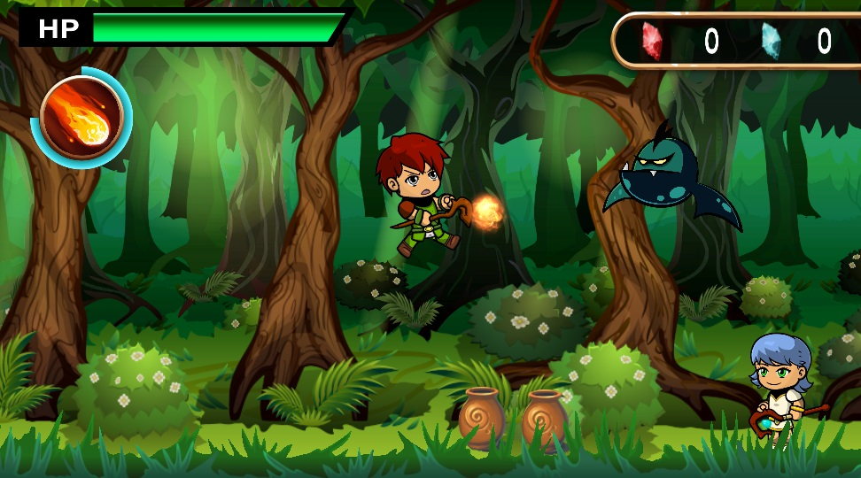
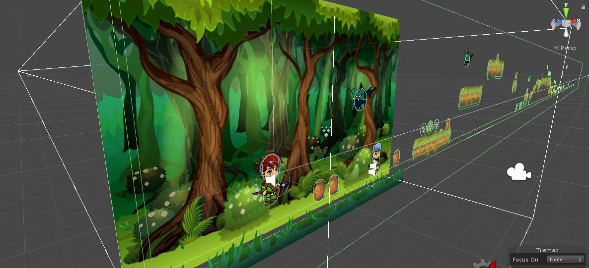

# The forest wizards

## Execution demo (GIF):

------
## Overview
*The forest wizards* is a 2D Unity game prototype where you, as player, get to control a wizard.  Move around the forest and cast some magic upon your enemies to make your way.  Be careful with the traps too!

### Category
A 2D platformer like Mario, Gunstar Heroes or Megaman. Aim your spells by pointing at any direction as you travel through the map.

### Controls (mechanics)
Use the "A" & "D" keys to move left or right. Hold Shift to run. Press the Space bar key to jump.  Click anywhere you wish to cast a spell on. The character will aim at the cursor.

### Development features
- Functional UI with Health, Magic and looted items.
- Use of Cinemachine to track player within a confined space.
- Animated character with Unity's Animation system.
- Use of Unity physics system to move the player and enemies (using forces, not Translate).
- Customized collision detection*
- Parallax background
- Item spawning props: The jar can be broken and it will spawn items (randomly).
- Fully working animated enemy (bat)
- Dangerous traps (spikes that substract HP to the player)
- Game over screen.
- Particle systems for multiple effects (crystal shards, forest fireflies, fireball trail, etc.)
- Easy sound effect instantiation through script.

### Customized collision detection
Perhaps one of the biggest difficulties I found was how to handle collisions when we had bodies that were subject to the physics. I had to make a neat script that would disable collisions between colliders to match my needs. So basicly (and really summed up), everything that is not an allowed collision, is to be ignored. That is, we set which objects can collide with others before starting the game so that the script will disable the rest at the start.
If an object only has a trigger collider, then it can be skipped out (it won't even have the script).

